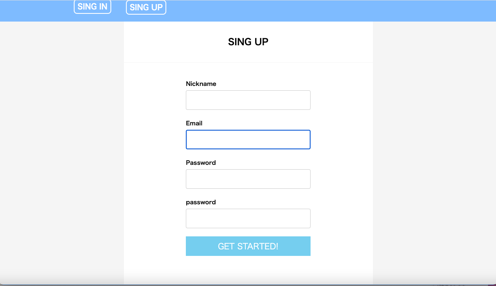

# README

# アプリケーション名
Sharedroom.com

# アプリケーション概要
・ユーザーのログイン

・部屋の出品

・出品した部屋の編集、削除

・部屋の検索

・部屋に対するコメント

・部屋に対するレビュー

# URL
"#######################"

# テスト用アカウント
・部屋出品用アカウント
mail: test@test1.com
password: test1234

・部屋確認用アカウント
mail: test@test2.com
password: test1234

# DEMO

トップページ

・ヘッダーのサインアップボタンでアプリケーションにサインアップ  
・「push a room」で必須項目を記入し部屋をアップロード  
・全ての部屋を見るためには検索欄を空白のまま「let's go」ボタンをクリック  
・検索欄にキーワードを記入することで部屋の絞り込みが可能  

サインインページ

サインアップページ

部屋の検索結果（空白で検索した時）※空白で検索した時、全ての部屋の一覧が表示される

部屋の検索結果（該当の部屋がある時）

部屋の検索結果がなかった時

部屋の出品

必須項目を入力することで部屋を投稿することができる  
また下部の「契約中」のボックスにチェクを入れることで出品した部屋の状態を契約中に変更することができる

# 利用方法

・部屋の出品者は部屋の詳細画面から編集、削除が可能

・サインアップユーザーは誰でも部屋の詳細画面、下部にあるコメント欄からコメントを投稿することができる

・部屋を出品したユーザー以外のサインアップユーザーは部屋の詳細画面からレビューを投稿することができる

・部屋を投稿したユーザーは編集から最下部の項目である「契約中」のチェクマークをクリックすることで出品している部屋の表示を契約中に変更することができる

# 目指した課題解決

・シェアハウスをすることでコミュニケーション能力の向上

・部屋の有効活用（子供が独り立ちし、部屋が余っている方など）

・学生や新卒など一人暮らしのための初期費用に余裕がない方が安く住居を見つけることができる

# 洗い出した要件

# 実装予定の機能

・画像の複数投稿

・ユーザー同士のマッチング（部屋を探しているユーザーと部屋を貸しているユーザーとでの条件によるマッチング機能）

# データベース設計

## users テーブル

| Column               | Type    | Options                  |
| -------------------- | ------- | ------------------------ |
| nickname             | string  | null: false              |
| email                | string  | null: false ,unique: true|
| encrypted_password   | string  | null: false              |
 
### Association

- has_many :rooms
- has_many :comments
- has_many :reviews

## room テーブル

| Column             | Type       | Options                        |
| ------------------ | ---------- | ------------------------------ |
| address            | text       | null: false                    |
| latitude           | integer    |                                |
| longitude          | integer    |                                | 
| station            | string     | null: false                    |
| describe           | text       | null: false                    |
| price              | integer    | null: false                    |
| date               | string     | null: false                    |
| pet_id             | integer    | null: false                    |
| air_conditioner_id | integer    | null: false                    |
| toilet_id          | integer    | null: false                    |
| bathroom_id        | integer    | null: false                    |
| kitchen_id         | integer    | null: false                    |
| phone_number       | string     |                                |
| mail               | string     |                                |
| rent               | boolean    |                                |
| user               | references | null: false, foreign_key: true |

### Association

- belongs_to :user
- has_many   :comments
- has_many   :reviews

## comments テーブル

| Column             | Type       | Options                        |
| ------------------ | ---------- | ------------------------------ |
| text               | text       |                                |
| user               | references | null: false, foreign_key: true |
| room               | references | null: false, foreign_key: true |

### Association

- belongs_to :user
- belongs_to :room

## reviews テーブル

| Column             | Type       | Options                        |
| ------------------ | ---------- | ------------------------------ |
| content            | string     |                                |
| score              | integer    |                                |
| user               | references | null: false, foreign_key: true |
| room               | references | null: false, foreign_key: true |

### Association

- belongs_to :user
- belongs_to :room

# ローカルでの動作方法
